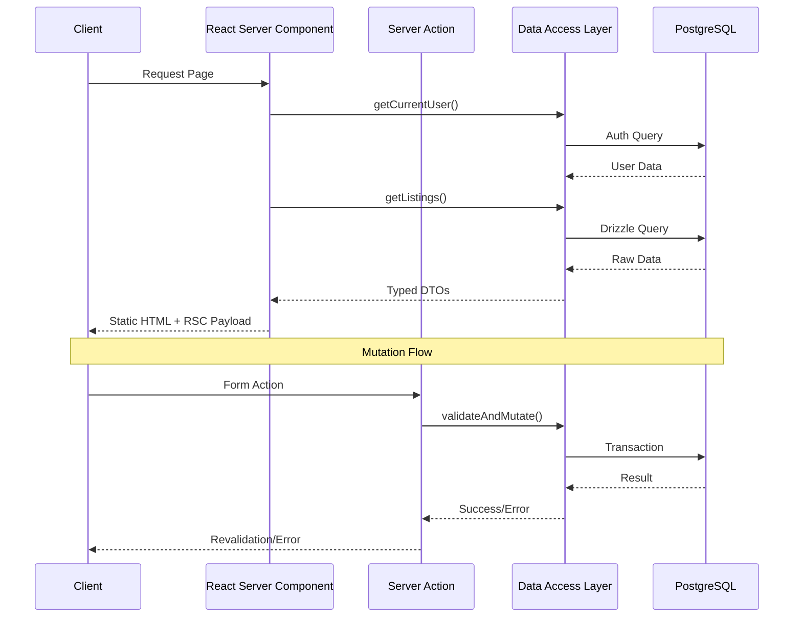
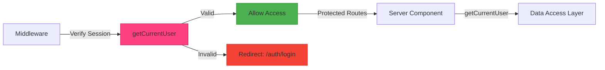
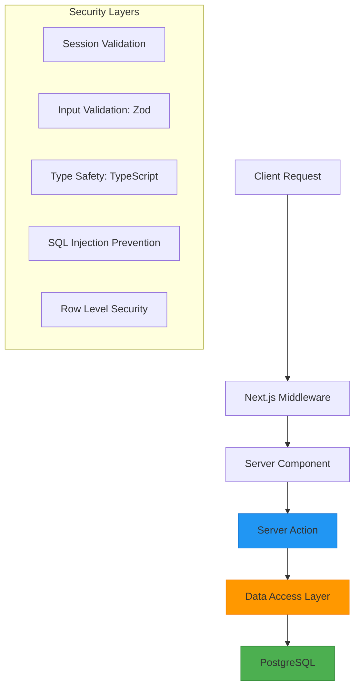

# Real Estate Application Architecture Diagrams

This document provides visual representations of the application architecture and key data flows.

## Application Layer Structure

```mermaid
graph TD
    subgraph "Data Access Layer"
        A[lib/db/schema.ts] --> B[lib/db/index.ts]
        C[lib/auth.ts] --> B
        D[lib/users.ts] --> B
    end

    subgraph "Server Actions"
        E[app/actions/listings.ts] --> A
        F[app/actions/users.ts] --> D
    end

    subgraph "Server Components"
        G[app/listings/page.tsx]
        H[app/listings/[id]/page.tsx]
    end

    subgraph "Client Components"
        I[components/listings/listing-form.tsx]
        J[components/listings/listing-card.tsx]
    end

    K[(PostgreSQL DB)] --> B
    G --> A
    H --> A
    I --> E
    J --> E

    style A fill:#2196F3,stroke:#1976D2
    style B fill:#4CAF50,stroke:#388E3C
    style E fill:#9C27B0,stroke:#7B1FA2
    style F fill:#FF9800,stroke:#F57C00
```

## Server-Side Data Flow



## Authentication Flow



## Security Architecture



## Key Implementation Details

1. **Type Safety**
   - Strict TypeScript throughout
   - Zod schemas for runtime validation
   - Drizzle schema for type-safe queries
   - DTOs for data transfer

2. **Performance**
   - React Server Components by default
   - Selective client components with `use client`
   - Server Actions for mutations
   - Edge runtime where applicable

3. **Data Security**
   - Middleware authentication
   - Server-side validation
   - PostgreSQL Row Level Security
   - Type-safe database queries

4. **Code Organization**
   - Feature-based directory structure
   - Separation of server/client concerns
   - Centralized data access layer
   - Reusable components

## Security Implementation

- **Authentication**
  - JWT-based session management
  - Route protection via middleware
  - Secure session cookie handling

- **Data Access**
  - Centralized through Data Access Layer
  - Parameterized queries via Drizzle
  - Row Level Security policies
  - Type-safe database operations

- **Input Validation**
  - Server-side Zod validation
  - TypeScript type checking
  - Sanitized database queries
  - XSS prevention

## Best Practices

- Server Components for data fetching
- Server Actions for mutations
- Edge runtime for global deployment
- Type safety at all levels
- Performance optimization via RSC
- Security in depth approach
