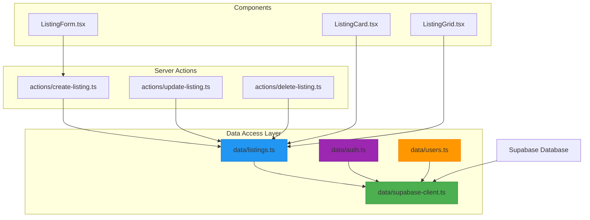
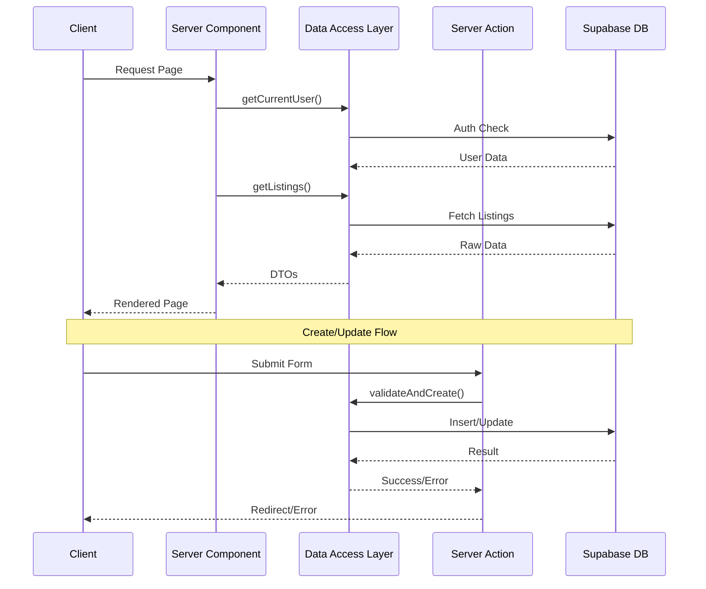
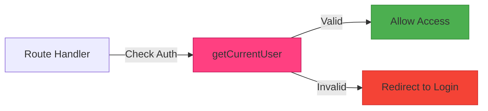
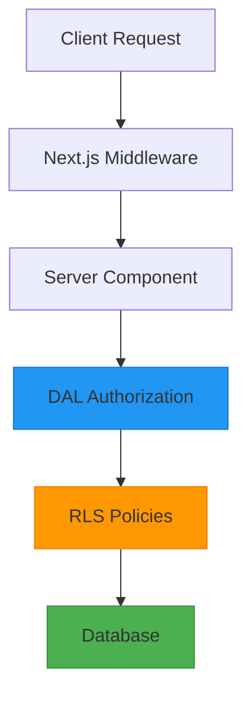

# Real Estate Application Architecture Diagrams

This document provides visual representations of the rental listing integration process and key architectural flows.

## Data Access Layer Structure

## Data Flow Sequence

## Authentication Flow

## Data Security Layers

## Key Implementation Notes

1. The Data Access Layer (DAL) centralizes all database interactions
2. Server Actions handle form submissions and data mutations
3. Authentication is checked at multiple levels (Middleware, DAL, RLS)
4. DTOs are used to sanitize data before sending to the client
5. Components are structured to optimize for server-side rendering
6. Security is implemented in layers from client to database

## Security Considerations

- All database access is routed through the DAL
- Authentication state is verified on every request
- Row Level Security (RLS) provides an additional security layer
- DTOs prevent exposure of sensitive data
- Server Actions validate all input data
- Middleware protects routes based on authentication state
